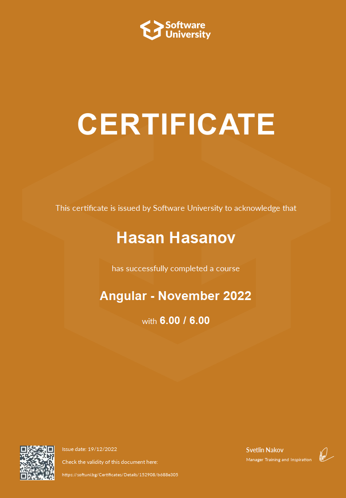

# Softuni-Angular

Intro to Angular and TypeScript

• HTTP Basics;
• Routing Overview;
• Angular Overview;
• Intro to TypeSctipt;
• Angular Installation and CLI.

Components

• Components Basic Idea;
• Creating Components;
• Bootstrapping and Models;
• Data Bindings and Templates;
• Lifecycle Hooks;
• Component Interaction.

DI, Intro to RxJS, Services

• Change Detection Strategy;
• SOLID Principles;
• Services;
• Obserables and RXJS;
• HTTP Client.

Modules and Routing

• NgModule;
• Routing Overview;
• Router Module (Links, Redirects, Query Params);
• Router Guards.

Forms

• Directives (Attribute, Structural, Building an Attribute);
• Handling Forms (Template-Driven and Reactive Forms).

Pipes, Interceptors and Subjects

• Pipes;
• JWT Authentication;
• Interceptors;
• Lazy Loading;
• Subjects.

State Management

• Introduction to Redux;
• NgRX Store (Store and App State, Actions, Reducers, Dispatching actions).

